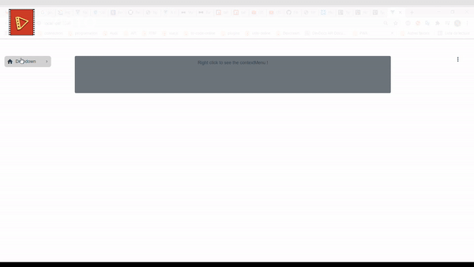

<!-- PROJECT LOGO -->
<br />
<p align="center">
  <h1 align="center">Dropdown menu multi level</h1>
  
</p>

<!-- TABLE OF CONTENTS -->
<details open="open">
  <summary>Table of Contents </summary>
  <ol>
    <li>
      <a href="#about-the-project">About The Project</a>
      <ul>
        <li><a href="#built-with">Built With</a></li>
      </ul>
    </li>
    <li>
      <a href="#getting-started">Getting Started</a>
      <ul>
        <li><a href="#installation">Installation</a></li>
      </ul>
    </li>
    <li>
      <a href="#usage">Usage</a>
      <ul>
        <li><a href="#import">How to import</a></li>
        <li><a href="#context-menu">As context-menu</a></li>
        <li><a href="#dropdown">As dropdown</a></li>
      </ul>
    </li>
  </ol>
</details>

<!-- ABOUT THE PROJECT -->

## About The Project

There are many great dropdown menu available on NPM, however, I didn't find one that really suit my needs so I created this enhanced one.

Here's why:

- You shouldn't spend your time to position the menu when is in the end of the screen. You can also use you own style.
- You can implement several menu levels. (each menu can have a sub menu up to infinity)
- You have the possibility to use it as a context menu ( in this case, the two characteristics mentioned above are also included)


<div align="center">

</div>


<!-- <video width="550" height="240" controls>
  <source src="dropdown-video" type="video/mp4">
</video>
 -->
### Built With

- [VueJs](https://vuejs.org)
- [Bootstrap](https://getbootstrap.com)
- [Material Design Icons](https://material.io/resources)
- [bp-vuejs-dropdown](https://brandquad.github.io/bp-vuejs-demo/#/dropdown)

<!-- GETTING STARTED -->

## Getting Started

This is an example of how you may give instructions on setting up your project locally.
To get a local copy up and running follow these simple example steps.

### Installation

1. NPM
   ```sh
   npm install dropdown-menu-multilevel
   ```
2. YARN
   ```sh
   yarn add dropdown-menu-multilevel
   ```

<!-- USAGE EXAMPLES -->

## Usage

<h3 id="import">
 1. How to import
</h3>

* Localy
   ```sh
   import bpContextMenu from "dropdown-menu-multilevel";
   ```
* Globaly
   ```sh
   import Vue from 'vue';
   import bpContextMenu from "dropdown-menu-multilevel";

   Vue.use('bpContextMenu')

   ```


<h3 id="context-menu">
 2. As Context-menu
</h3>

```html
<template>
  <div id="app">
    <div class="row w-100 wrapper">
      <div class="col col-sm-8 alert bg-secondary " @contextmenu="contextMenu">Right click to see the contextMenu !</div>
    </div>
    <bpContextMenu
      ref="myContextMenu"
      asContextMenu
      trigger="hover"
      label="Dropdown-right"
      :list="listItems"
      @clickOnItem="clickOnItem($event)"
    >
    </bpContextMenu>
  </div>
</template>

<script>
import bpContextMenu from "dropdown-menu-multilevel";


export default {
  name: "App",
  components: {
    bpContextMenu,
  },
  data() {
    return {
      listItems: [{
          label: "action 1",
          icon: "palette",
          align: "",
          children: [{
              label: "sub-action",
              className:"sub-action",
              children: [{
                icon: "edit",
                label: "sub-sub-action 1 ",
                },
              {
                label: "sub-sub-action 2",
              }]
            }],
          },
          {
           label: "action 2",
           icon: "delete",
           className: 'single',
          },
        ],
    };
  },
  methods: {
    clickOnItem(el) {
      console.log("item app", el);
    },
    contextMenu(e) {
      this.$refs.myContextMenu.$children[0].isHidden = false
      this.$refs.myContextMenu.$children[0].$nextTick(()=> {
       this.$refs.myContextMenu.$children[0].top = e.clientY
      this.$refs.myContextMenu.$children[0].left = e.clientX
     }, this)
      e.preventDefault()
    }
  },
};
</script>

<style lang="scss">
#app {
  font-family: Avenir, Helvetica, Arial, sans-serif;
  -webkit-font-smoothing: antialiased;
  -moz-osx-font-smoothing: grayscale;
  text-align: center;
  color: #2c3e50;
  margin-top: 60px;
}
.wrapper {
  height: 150px
}

</style>
```
<h3 id="dropdown">
3. As dropdown
</h3>
 
```html
<template>
  <div style="width: 12rem">
    <DpMultilevel
    :list="listItems"
    className="my-class"
    label="Dropdown"
    @clickOnItem="clickOnItem($event)"
  >
  </DpMultilevel>
  </div>
</template>

<script>
  import DpMultilevel from 'dropdown-menu-multilevel'
  export default {
    components: {DpMultilevel},
    data() {
      return {
        listItems: [{
          label: "action 1",
          icon: "palette",
          align: "",
          children: [{
              label: "sub-action",
              className:"sub-action",
              children: [{
                icon: "edit",
                label: "sub-sub-action 1 ",
                },
              {
                label: "sub-sub-action 2",
              }]
            }],
          },
          {
           label: "action 2",
           icon: "delete",
           className: 'single',
          },
        ]
      }
    },
    methods: {
       clickOnItem(el) {
      console.log("item app", el);
    },
    }
  }
</script>

<style lang="css">
  .my-class-bp__btn {
    background: lightgray;
    padding: 8px;
    border-radius: 8px;
    cursor: pointer;
    width: 35px;
  }
  .single {
    padding-left: 2em;
  }
  .my-class-bp__body {
    width: 12rem;
    padding: 0.6rem;
    font-size: 1rem;
    min-height: 5rem;
  }
  .sub-action-bp__btn {
    padding: 8px;
    cursor: pointer;
  }
  .sub-action-bp__body {
    width: 13rem;
    padding: 0.7rem;
    font-size: 1.3rem;
    min-height: 7rem;
  }
</style>
```

## Props 


| Name          |    Type      |  Default | Description |
|---------------|--------------|----------|-------------|
| label | string |   | Text content to place on the button.
| list | array |   | the list of items in the menu.
| align | string | right | To Position the menu.  value can takes : 'left , right (default), top, bottom'.
| offsetX | number |  0 | The value (in pixels) of the horizontal translation of the menu in relation to the button.
| offsetY | number |  0 | The value (in pixels) of the vertical translation of the menu in relation to the button.
| trigger | string |  click | When the value is 'click' the menu can show only by click on the button. other value is 'hover' in this case the menu is show by hover on button.
| hideChevron | boolean |  false | When the value is set to true the chevron is hidden. 
| className | string |    | The name of the class which allows you to add and / or modify the style of your dropdown
| iconName | string |    | The name of the icon that appears on the left of the label
| asContextMenu | boolean |  false  | When the value is set to true, you can use it  as context-menu instead of dropdown 
---------------------------------------------------------------

* The `list` props is an array of object. each object may have several properties, that most of them were explained just above 'label, offsetX, offsetY ... etc'. the `children` property represent the sub-menu of this item and its role is like the `list` props. each item in the children property may have the item list property. 'label, className, align, offsetX, offsetY, icon, hideChevron and children'. See example below

* Example
```js
list:[
  {
    label: "action a",
    children: [
      {
        label: "sub-action 1",
        className:"sub-action-1",
        align:"left",
        offsetX:10,
        offsetY: 10,
        icon: "edit",
        hideChevron: true,
        children: [
          { label: "sub-sub-action 1 " },
          { label: "sub-sub-action 2" }
        ]
      },
      { label: "sub-action 2" }
    ],
  },
  { label: 'action b' },
  { label: 'action c' },
  { label: 'action d' },
  

]
```

## License

Distributed under the MIT License. See `LICENSE` for more information.

<!-- CONTACT -->

## Contact

Noreddine RADI - [@linkedin](https://www.linkedin.com/in/noreddine-radi-6268b187/) - noreddine_radi@live.fr

Project Link: [dropdown-menu-multilevel](https://gitlab.com/Noradi/dropdown-menu-multi-level)

